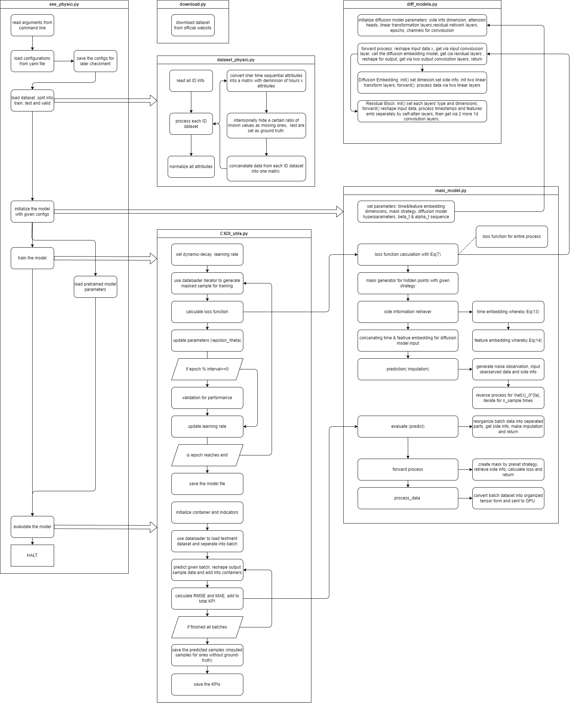
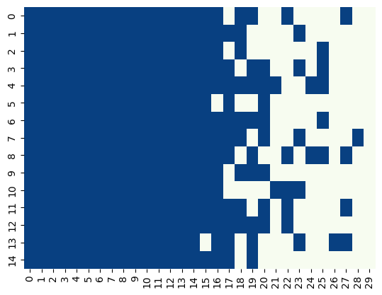

# CSDI: model reimplementation and optimization

## Task
> CSDI: Conditional Score-based Diffusion Models for Probabilistic Time Series Imputation
> 1. read the paper, make a summary
> 2. read the code, understand the project architecture
> 3. simple modifications upon raw code to make it work.
> 4. add more details in essential modules
> 5. test the code upon `healthcase` dataset,
> 6. data visialization upon `healthcase` dataset
> 7. make improvements upon demo.

## Summary of paper

1. brief introduction
> Most of the raw data retrieved from different data sources consist of missing values (NaN values), and the most common method of dealing with missing values is directly dropping them. This paper provides an alternative solution by using the imputation model proposed in the following paper. 
> CSDI is a diffusion model which generates missing values in raw data by diffusion process using observed values as conditional input. The model is trained by optimizing an unsupervised task: recovery of a certain ratio of masked observed data by using the rest observed data as conditional input. When performing real imputation on datasets, all missing values are imputation targets and all observed values serve as conditional input.
1. innovations
   1. proposed a conditional diffusion model for time series imputation
   2. and a self-supervised training method to handle the missing values
2. formula expression
   1. $X=\{x_{1:K,1:L}\}\in \mathbb{R}^{K\times L}$ is the origin time series, where $K$ is  the number of features , $L$ is the length of timespan. $M=\{m_{1:K,1:L}\}\in \{1,0\}^{K\times L}$ is the observation mask. Timestamp is $s=\{s_{1:L}\}$ . Each time series is expressed as  $\{\bold{X,M,s}\}$ 
   2. forward process in model is defiend by Markov chain: $$q(\bold{x}_{1:T} | \bold{x}_0)\coloneqq \prod_{t=1}^T q(x_t|x_{t-1}), q(x_t|x_{t-1})\sim \mathcal{N}(\sqrt{1-\beta_t}x_{t-1},\beta_t \bold{I})$$ , where $\beta_t$ is the small positive constant to constrain the input noise.  $\hat{\alpha}\coloneqq 1-\beta_t,\alpha_t\coloneqq \prod_{i=1}^t\hat{\alpha}_i$ . 
   3. Reverse process denoises is defined by Markov chain as well: $$p_\theta(\bold{x}_{0:T})\coloneqq p(\bold{x}_T)\prod_{t=1}^T{p_\theta(\bold{x}_{t-1} | \bold{x}_{t})},\bold{x}_T\sim \mathcal{N}(\bold{0,I})$$ 
   4. denoising diffusion probabilistic models (DDPM) with parameters: $$\bold{\mu}_\theta(\bold{x}_t,t)=\frac{1}{\alpha_t}\bigg({\bold{x}_t-\frac{\beta_t}{\sqrt{1-\alpha_t}}\epsilon_\theta(\bold{x}-t,t)}\bigg)\\
   \sigma_\theta(\bold{x}_t,t)=\left\{\begin{array}{l}\frac{1-\alpha_{t-1}}{1-\alpha_{t}}\beta_t&&t>1\\\beta_1&&t=1
   \end{array}\right.
$$
   1. Our goal is to predict conditional probability of $q(\bold{x}^{ta}_0 | \bold{x}^{co}_0)$ . Whereby adding an input $\epsilon_\theta$ into prediction noise netwrok to represente $x_0^{co}$ , loss function turns into: $$\hat{\theta}=\arg\min\limits_{\theta}\mathcal{L}(\theta)\coloneqq\arg\min\limits_{\theta}\mathbb{E}_{x_0\sim q(x_0),\epsilon\sim\mathcal{N}(0,\bold{I}),t}{\lVert\epsilon-\epsilon_\theta(x_{t}^{ta},t | x^{co}_0)   \rVert^2_2}$$
1. model architecture

   1. training: **self-supervised learning** like MLM, manually masked a part of oberved values as missing ones and train the model to impute this part. 
   2. four strategy of mask is provided:
      1. *random strategy*
      2. *historical strategy* exploit missing pattern among different samples
      3. *mix strategy* mix of above two strategies, avoid overfitting.
      4. *test pattern strategy* when we know the missing pattern in test dataset.
   3. right-most part procedure is the same as DDPM but with one more input $x^{co}_0$.
   4. 2-dimensional **attention mechanism** is used in each residual layer to capture temporal and feature dependencies.
   5. **side information** is provided for training along with $\epsilon_\theta$: time embedding $\bold{s}$ and categorical feature embedding for $K$ features.
   6. model is based on **DiffWave** and refined for time series imputation: replacing convolution kernel with transformer structure for capture of time series features.
1. results
   
   1. improves the continuous ranked probability score(CRPS) over existing probabilistic methods
   2. decreases the mean absolute error (MAE) compared with sota
   3. can be applied to time series interpolations or forecasting for one step further.

## Structure of demo

Project structure overview:

Functions of each source file:
1. `download.py`: download dataset from official website, saved in `./data/`
2. `exe_physio.py`: shell functions for execution
   1. essential arguments: config file, device, seed, test missing ratio, fold number for testing in 5-fold test, pretrained model to load, count of samples.
   2. load config settings: `config["model","diffusion","train"]` and save to `./save/physio_fold.../` in json form
   3. create the iterators for loading dataset by `get_dataloader()`
   4. initialize the model by `CSDI_Physio()`
   5. train the model by `train()`
   6. test the model by `evaluate()`
3. `dataset_physio.py`: load dataset from `./data/physio/set-a/*`
   1. divide dataset into 3 parts: training, testment, and validation
   2. create iterators for loading data, each with different observed values and masks 
   3. preset a ratio for missing values in attributes
   4. set the rest values as ground truth, aiming to train the model to predict the missing values that are hidden intentionally
   5. normalize each attributes of all patients with Z-score normalization $\tilde{\bold{x}}=\frac{\bold{x}-\mu}{\sigma^2}$, where mean and std omittes all missing values.
4. `main_model.py`:class for CSDI model
   1. `CSDI_physio` overwrite `process_data()`
   2. `CSDI_base.init()`:set model layers and hyperparameters, calculate coefficents like $\beta,\alpha,\hat{\alpha}$ 
   3. `CSDI_base.time_embedding()` get time embedding sequence
   4. `CSDI_base.get_randmask()` set mask to split observed values for training precedure, same as `get_hist_mask()` yet another strategy
   5. `CSDI_base.get_side_info()` get time embedding and categorical feature embedding
   6. `CSDI_base.calc_loss()`: calculate loss function
   7. `CSDI_base.impute()` reverse process, uesd in evaluation part and validation part if exists
   8. `CSDI_base.forward()` forward process, used in training part
   9. `CSDI_base.evaluate()` a shell function for prediction part
5. `diff_models.py`: kernel diffusion model implementation
   1. `diff_CSDI` class of model based on DiffWave, with multiple 1D convolution layers, a diffusion embedding layer and 2 layers of residual network.
   2.  `DiffusionEmbedding` with 2 liner projection layers.
   3.  `ResidualBlock` residual network with self-attension feedforward networks to process raw time series data into latent variables and 3 1D convolution layers.
6. `CSDI_utils.train()`:
   1. set learning rate decay strategy
   2. for each epoch, process the batches, feed in the model, calculate the loss, optimize the parameters in standard torch.nn.Module architecture
   3. display the average loss in each epoch
   4. at certain epoch, validate the model performance in validation dataset
   5. save the model after all epoches
7. `CSDI_utils.evaluate()`:
   1. prepare the container for each batch of test dataset
   2. gather together output of each batch
   3. calculate KPIs of each batch
   4. save the imputated data and KPIs in pickle form

## Simple modifications

Commit records can be checked in [CSDI/myWork-github](https://github.com/Deagle-PrintStream/CSDI/tree/myFork)
1. minor bug fixs: 
   1. variable type declearations
   2. no more implicit type conversion
   3. complete different modes in accordance with input argument
   4. some boundary test negligence fixed
2. an alterative dataset loading method for better data visualization.
3. add annotation for essential functions in diffusion models
4. add `logging` and `line_profiler` module to better view the time consumption and training process. 

## Details in essential modules

Increased the training speed technically by modifying some codes without changing algorithm. Denote attribute count as $K$, epoches as $n$, dataset size as $N$
- In `calc_loss` funciton, a sentence of none-zero value judgement consumed a large amount of time. This reduced time linearly by $O(K\times n\times N)$ . Before & After:
```txt
Line #      Hits         Time  Per Hit   % Time  Line Contents
==============================================================
   125                                               def calc_loss(
   126                                                   self, observed_data, cond_mask, observed_mask, side_info, is_train, set_t=-1
   127                                               ):
......
   140                                           
   141       700  125313873.0 179019.8     63.5          predicted = self.diffmodel(total_input, side_info, t)  # (B,K,L)
   142                                           
   143       700     245323.0    350.5      0.1          target_mask = observed_mask - cond_mask
   144       700     383452.0    547.8      0.2          residual = (noise - predicted) * target_mask
   145       700     227240.0    324.6      0.1          num_eval = target_mask.sum()
   146       700   65056648.0  92938.1     33.0          loss = (residual ** 2).sum() / (num_eval if num_eval > 0 else 1) #this one
   147       700      11943.0     17.1      0.0          return loss
```
```txt
Line #      Hits         Time  Per Hit   % Time  Line Contents
==============================================================
   125                                               def calc_loss(
   126                                                   self, observed_data, cond_mask, observed_mask, side_info, is_train, set_t=-1
   127                                               ):
......
   140                                           
   141       700   57276170.0  81823.1     90.6          predicted = self.diffmodel(total_input, side_info, t)  # (B,K,L)
   142                                           
   143       700     112499.0    160.7      0.2          target_mask = observed_mask - cond_mask
   144       700     163184.0    233.1      0.3          residual = (noise - predicted) * target_mask
   145       700     102117.0    145.9      0.2          num_eval = target_mask.sum()
   146                                                   #loss = (residual ** 2).sum() / (num_eval if num_eval > 0 else 1) # this one
   147       700       2851.0      4.1      0.0          try:    
   148       700     264781.0    378.3      0.4              coeff=1/num_eval
   149       700     342050.0    488.6      0.5              loss=torch.pow(residual , 2).sum() * coeff
   150                                                   except ValueError:
   151                                                       loss=torch.pow(residual , 2).sum()
   152                                                   finally:
   153       700       2961.0      4.2      0.0              return loss #type:ignore
```
- In `train` function, a sentence to display the loss per step with `tensor.item()` consumed large amount of time but not actually interact with model training. This reduced time linearly by $O(K\times n\times N)$ .Before & After:
```txt
Line #      Hits         Time  Per Hit   % Time  Line Contents
==============================================================
......
    50      3500    7288286.0   2082.4      0.3                  optimizer.zero_grad()
    51
    52      3500  904760364.0 258503.0     35.6                  loss = model(train_batch)
    53      3500  228619794.0  65319.9      9.0                  loss.backward()
    54      3500 1093801472.0 312514.7     43.1                  avg_loss += loss.item() # this one
    55      3500  118461700.0  33846.2      4.7                  optimizer.step()
    56      3500    1389810.0    397.1      0.1                  it.set_postfix
......
```

```txt
Line #      Hits         Time  Per Hit   % Time  Line Contents
==============================================================
......
    52       700    1262337.0   1803.3      0.2                  optimizer.zero_grad()
    53
    54       700  522404623.0 746292.3     87.9                  loss = model(train_batch) #major time cosumed as expected
    55       700   44506403.0  63580.6      7.5                  loss.backward()
    56       700     234148.0    334.5      0.0                  loss_sum+=loss 
    57                                                           #by shifting the loss sum up calculation into GPU and decrease the hit of `item()`, time saved a lot
    58       700   21079172.0  30113.1      3.5                  optimizer.step()
    59       700     203786.0    291.1      0.0                  it.set_postfix(
    60       700       3090.0      4.4      0.0                      ordered_dict={
    61                                                                   #"avg_epoch_loss": avg_loss / batch_no, #we want to reduce the hit of `item()`
    62       700       3825.0      5.5      0.0                          "epoch": epoch_no,
    63                                                               },
    64       700       1537.0      2.2      0.0                      refresh=False,
    65                                                           )
    66         2        642.0    321.0      0.0              lr_scheduler.step() #this one should come after validation part?
    67         2     751094.0 375547.0      0.1          avg_loss=loss_sum.item()/batch_no
    68         2       6689.0   3344.5      0.0          logging.info(f"average loss:{avg_loss} at epoch:{epoch_no}")
......
```
## Result reimplementation

Performance of CSDI model on healthcare dataset with 10% missing ratio: 

```yaml
missing_ratio: 0.10
is_unconditional: 0
target_strategy: "random"
seed: 1
nsample: 100
train:
  epochs: 200
  batch_size: 16 
  lr: 1.0e-3
```
| nfold | CRPS | MAE|
|:-:|:-:|:-:|
|0 |0.2340862876490543 | 0.21497521362257221 |
|1 |0.24621202002478395| 0.22479919755130056|
|2 |0.24028229310065546 |0.21689541339689117 |
| 3| 0.2385617557324861| 0.21800483008528726|
| 4| 0.24332977596082186| 0.2209671990463743|

- mean and the standard error of CRPS :`0.240` and `0.004`
- mean and the standard error of MAE :`0.219` and `0.003`

See: [results reimplementation](../visualize_examples.ipynb)

## Data visualization

See: [data visualization on healthcare dataset](./data_visualization.ipynb)

## Improvements

Introduced a new mask generating strategy speicfied for future forecasting. The original mask strategy is to randomly pick up a ratio $ k $ of observed values $X\in \mathbb{R}^{K\times L}$ as masked for each record, where $k \sim \mathcal{U}(0,1)$, $L $ is length of timespan and $ K $ is number of attributes.

In forecasting task, missing values is rather a minor problem so we omit it. A simple way is to mask the latest $l_{miss}\leqslant L$ values of all attributes as missing in each record, which is a subset of `test` strategy given in the paper but not implemented. The `cond_mask` would be static and look like $ \bigg(\mathbf{1}^{K\times (L-l)}, \mathbf{0}^{K\times l} \bigg)$, where $ l $ is relative to  `test_missing_ratio` hyperparameter.

Another way is to add some noise into this mask generation strategy. For each racord, we first generate a metrix $\bold{M}$ with all uniform distribution, then mutiplied by a weight array in timespan dimension $\bold{M}=\bold{M}\odot \bold{W}$, where $W_{ij}=b^{j/L}, 0<b<1$ . Finally we pick up a ratio $k \sim \mathcal{U}(0,1) $ of the largets numbers in $\bold{w}$ as missing ones, this operation corresponds with the given `random` strategy. The `cond_mask` would look like this (x-axis for timespan and y-axis for attributes for example):

